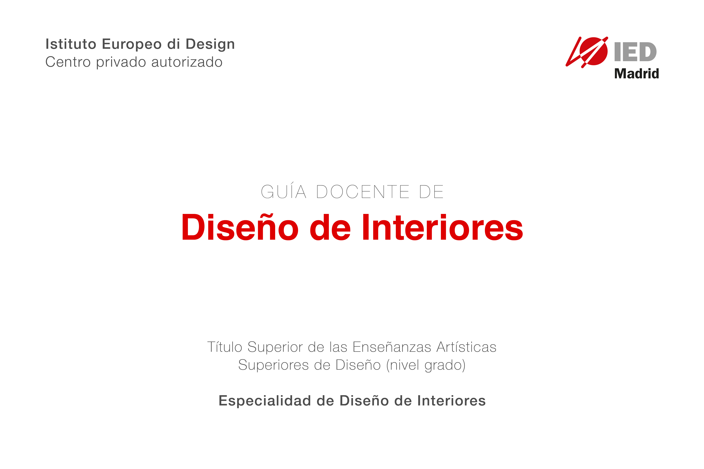

# Diseño de Interiores - Prueba

### **1. IDENTIFICADORES DE LA ASIGNATURA**

| \*\*\*\* |  |
| :--- | :--- |
| **Tipo** | Obligatoria de Especialidad |
| **Carácter** | Teórico-práctica |
| **Especialidad/itinerario/estilo/instrumento** | Diseño de Interiores |
| **Materia** | Proyectos del diseño de interiores |
| **Periodo de impartición** | 2º Semestre |
| **Número de créditos** | 4 ECTS |
| **Departamento** | Departamento de didáctica especialidad interiores |
| **Prelación/ requisitos previos** | Esta asignatura no tiene requisitos previos. |
| **Idioma/s en los que se imparte** | Español |

### **2. PROFESOR RESPONSABLE DE LA ASIGNATURA**

| **Apellidos y nombre** | **Correo electrónico** |
| :--- | :--- |
| Amann, Beatriz |  |

### **3. RELACIÓN DE PROFESORES Y GRUPOS A LOS QUE IMPARTEN DOCENCIA**

| **Apellidos y nombre** | **Correo electrónico** | **Grupos** |
| :--- | :--- | :--- |
| Amann, Beatriz |  | Todos |

### **4. COMPETENCIAS**

| **Competencias transversales** |
| :--- |
| CT1 Organizar y planificar el trabajo de forma eficiente y motivadora.  |
| CT2 Recoger información significativa, analizarla, sintetizarla y gestionarla adecuadamente. |
| CT3 Solucionar problemas y tomar decisiones que respondan a los objetivos del trabajo que se realiza. |
| CT8 Desarrollar razonada y críticamente ideas y argumentos. |
| CT11 Desarrollar en la práctica laboral una ética profesional basada en la apreciación y sensibilidad estética, medioambiental y hacia la diversidad.  |
| CT14 Dominar la metodología de investigación en la generación de proyectos, ideas y soluciones viables.  |
| CT16 Usar los medios y recursos a su alcance con responsabilidad hacia el patrimonio cultural y medioambiental.  |
| CT17 Contribuir con su actividad profesional a la sensibilización social de la importancia del patrimonio cultural, su incidencia en los diferentes ámbitos y su capacidad de generar valores significativos. |

\*\*\*\*

| **Competencias generales** |
| :--- |
| CG1 Concebir, planificar y desarrollar proyectos de diseño de acuerdo con los requisitos y condicionamientos técnicos, funcionales, estéticos y comunicativos.  |
| CG3 Establecer relaciones entre el lenguaje formal, el lenguaje simbólico y la funcionalidad específica.  |
| CG8 Plantear estrategias de investigación e innovación para resolver expectativas centradas en funciones, necesidades y materiales.  |
| CG14 Valorar la dimensión del diseño como factor de igualdad y de inclusión social, y como trasmisor de valores culturales.  |
| CG21 Dominar la metodología de investigación. |

| **Competencias específicas** |
| :--- |
| CEI1 Generar y materializar soluciones funcionales, formales y técnicas que permitan el aprovechamiento y la utilización idónea de espacios interiores.  |
| CEI4 Analizar, interpretar, adaptar y producir información relativa a la materialización de los proyectos.  |
| CEI5 Resolver los problemas estéticos, funcionales, técnicos y constructivos que se planteen durante el desarrollo y ejecución de un proyecto.  |
| CEI15 Reflexionar sobre la influencia social positiva del diseño, su incidencia en la mejora de la calidad de vida y del medio ambiente y su capacidad para generar identidad, innovación y calidad en la producción. |

### **5. RESULTADOS DE APRENDIZAJE**

* Identificar la disciplina del diseño de interiores, espacios y experiencias de usuario.
* Identificar el proceso de diseño de interiores.
* Identificar los sistemas que lo conforman.
* Identificar el alcance, campos de trabajo y posibilidades del diseño de interiores.
* Ser capaz de aplicar la metodología del proyecto de diseño de espacios.
* Saber aplicar la metodología a casos de estudio.
* Poder gestionar la documentación descriptiva.
* Ser capaz de experimentar con modelos.

### **6. CONTENIDOS**

| **I. INICIACIÓN AL DISEÑO DE ESPACIOS** |
| :--- |
| Tema 1. El rol del diseñador de espacios |
| Tema 2. La mirada del diseñador. Diseño estratégico |
| Tema 3. Los sistemas del espacio: usuario, morfología, materia, topología y campo |
| Tema 4. Metodología del proceso de diseño: crítica del proceso |
| Tema 5. Iniciación al diseño estratégico |

| **II.- PROYECTO** |
| :--- |
| Tema 6. El briefing y los grados de relación: usuario-objeto-espacio  |
| Tema 7. El diseño centrado en el usuario y la experiencia de usuario  |
| Tema 8. Proceso de diseño: pensar, construir, comunicar |

### **7. PLANIFICACIÓN TEMPORAL DEL TRABAJO DEL ESTUDIANTE**

| **Tipo de actividad** | **Total horas** |
| :--- | :--- |
| Actividades teóricas  | 13 horas |
| Actividades prácticas  | 13 horas |
| Otras actividades formativas de carácter obligatorio \(jornadas, seminarios, etc.\)  | 32 horas |
| Realización de pruebas  | 14 horas |
| Horas de trabajo del estudiante  | 15 horas |
| Preparación prácticas  | 27 horas |
| Realización de pruebas | 6 horas |
| **Total de horas de trabajo del estudiante**  | **120 horas** |

### **8. METODOLOGÍA**

#### **Actividades teóricas**

Se utiliza principalmente la clase magistral: exposición de contenidos mediante la presentación o explicación por parte del docente y que se apoya en el uso de las TIC’s.

Durante dicha exposición se podrán plantear preguntas, resolver las dudas que puedan presentarse, orientar la búsqueda de información, ocasionar el debate individual o en grupo, etc.

En estas sesiones se imparte el contenido de la asignatura proponiendo inputs de información trilaterales \(docente-alumno-grupo de alumnos\) y desarrollándolos de manera tangible en ejercicios destinados a formar parte de las actividades prácticas.

#### Actividades prácticas

Se utiliza el aprendizaje basado en proyectos: situaciones en las que el alumno debe explorar y trabajar, de forma individual y/o grupal un problema práctico/caso de estudio aplicando conocimientos interdisciplinares bajo la supervisión del docente. En este caso, relativos a los sistemas que conforman el espacio y la metodología del proceso de diseño en su aplicación al diseño de espacios e interacción con el usuario en los mismos. En este caso, el proyecto incluye el desarrollo de un modelo.

Presentación de proyectos: exposición del proyecto asignado a un estudiante o grupo de estudiantes.

#### Otras actividades formativas de carácter obligatorio \(jornadas, seminarios, etc.\)

Taller de interiores: periodo de instrucción realizado con el objetivo de revisar y discutir los conceptos y temas presentados en las clases. En estas sesiones de apoyo al trabajo propuesto para el desarrollo de la asignatura el estudiante podrá resolver dudas y profundizar en los contenidos impartidos en las actividades teóricas y/o prácticas.

Con el objetivo de profundizar en la asignatura se proponen, además, las siguientes actividades formativas de carácter obligatorio: Visita a espacios referencia del diseño de interiores en Madrid.

Las conclusiones de estas visitas se incorporarán al desarrollo de los trabajos.

El docente acompañará a los estudiantes en las visitas para relacionar los contenidos de las mismas con los de las actividades frontales.

### **9. CRITERIOS E INSTRUMENTOS DE EVALUACIÓN Y CALIFICACIÓN**

Se evaluará:

1. Identificar la disciplina del diseño de interiores, espacios y experiencias de usuario.
2. Identificar el proceso de diseño de interiores.
3. Identificar los sistemas que lo conforman.
4. Identificar el alcance, campos de trabajo y posibilidades del diseño de interiores.
5. Ser capaz de aplicar la metodología del proyecto de diseño de espacios.
6. Saber aplicar la metodología a casos de estudio.
7. Poder gestionar la documentación descriptiva.

La evaluación debe diseñarse y planificarse de manera que quede integrada dentro de las actividades formativas de enseñanza/aprendizaje.

Se propone que la evaluación del aprendizaje de los alumnos sea continua, personalizada e integradora:

* Continua en cuanto que está inmersa en el proceso de enseñanza-aprendizaje y consecuentemente no limitada por fechas o situaciones concretas.
* Personalizada, ya que ha de tener en cuenta las capacidades, destrezas y actitudes del alumno. Se prestará especial atención en cuanto a la participación del alumno en los grupos de trabajo.
* Integradora en cuanto exige tener en cuenta las capacidades generales establecidas para la etapa, a través de los objetivos de las distintas unidades temáticas y áreas.

Se evaluarán los aprendizajes de los alumnos en relación con el logro de los objetivos educativos determinados en el currículo y asociados a los objetivos generales y específicos, tomando como referencia inmediata los criterios de evaluación establecidos para el área.

Para evaluar el proceso de aprendizaje de los alumnos es necesario:

* Evaluar la competencia curricular de los mismos \(capacidades y aptitudes\).
* Evaluar los factores que dificultan o facilitan un buen aprendizaje.
* Propiciar la autoevaluación y coevaluación de los propios alumnos como fuente de análisis y crítica de resultados, con el fin de permitir modificaciones de actitudes para su perfeccionamiento.
* Valorar el contexto de aprendizaje en el que se desenvuelve el alumno.

### **9.1. INSTRUMENTOS DE EVALUACIÓN**

#### Actividades teóricas

Se solicitará la participación en los debates generados en las sesiones teóricas.

#### Actividades prácticas

Se planteará el desarrollo de entregables parciales y un proyecto final, individual o grupal, en relación a los contenidos del curso. Se definirán unos requisitos de entrega específicos para cada entrega. Se planteará la elaboración de un modelo final como parte del proyecto final.

#### Otras actividades formativas de carácter obligatorio \(jornadas, seminarios, etc.\)

Se planteará la asistencia a visitas organizadas. Se planteará la asistencia y participación en el espacio de taller de interiores.

### **9.2. CRITERIOS DE EVALUACIÓN**

#### Actividades teóricas 

Asistencia a clase. Participación en los debates generados en las sesiones. 

#### Actividades prácticas 

Asistencia a clase. Realización, presentación y entrega en fecha establecida de los entregables y proyecto final, individual o grupal, propuestos relacionados con los contenidos del curso:

* Evaluación de la práctica realizada
* Evaluación de las conclusiones o proyectos presentados
* Evaluación del modelo final

Evaluación de la interacción durante el proyecto en grupo, en su caso.

#### Otras actividades formativas de carácter obligatorio \(jornadas, seminarios, etc.\) 

Asistencia y participación en las sesiones de taller de interiores organizadas. Asistencia a las visitas organizadas.

### 9.3. CRITERIOS DE CALIFICACIÓN

1. El sistema de evaluación a emplear en la asignatura se adapta al modelo de la evaluación continua.
2. En el sistema de evaluación continua la asistencia a clase es obligatoria y el estudiante deberá cumplir con un porcentaje de actividad con presencia del profesor, cuya estimación será, en principio, del 80% \(mínimo\).
3. En aquellos casos en los que el estudiante no cumpla con los requisitos exigidos para la evaluación continua presentará una entrega específica para la evaluación con pérdida de evaluación continua que podrá constar de aquellas partes que se estimen oportunas, quedando reflejados sus correspondientes pesos relativos en el apartado correspondiente de esta guía.
4. En cualquier caso, el estudiante contará con una convocatoria extraordinaria cuya estructura, instrumento de evaluación y calificación queda explicitado en la esta guía.
5. Para optar a evaluación continua, se deben entregar todos y cada uno de los trabajos prácticos propuestos en la fecha establecida.

### 9.3.1. Ponderación de los instrumentos de evaluación para la evaluación continua

| **Instrumentos** | **Ponderación** |
| :--- | :--- |
| Realización, presentación y entrega de entregables parciales  | 20% |
| Realización, presentación y entrega de proyecto final  | 70% |
| Participación en: taller, correcciones, debates, visitas… | 10% |
| **Total**  | **100%** |

### **9.3.2. Ponderación de instrumentos de evaluación para la evaluación con pérdida de evaluación continua**

| **Instrumentos** | **Ponderación** |
| :--- | :--- |
| Realización, presentación y entrega de proyecto específico para la evaluación con pérdida de evaluación continua | **90%** |
| **Total**  | **100%** |

### **9.3.3. Ponderación de instrumentos de evaluación para la evaluación extraordinaria**

| **Instrumentos** | Ponderación |
| :--- | :--- |
| Realización, presentación y entrega de proyecto específico para la evaluación extraordinaria | 50% |
| **Total**  | **100%** |

### **9.3.4. Ponderación para la evaluación de estudiantes con discapacidad**

Las adaptaciones de los instrumentos de evaluación deberán tener en cuenta los diferentes tipos de discapacidad

| **Instrumentos**  | **Ponderación** |
| :--- | :--- |
| Se determinarán en función de la discapacidad |  |
| **Total**  | **100%** |

### **10. PLANIFICACIÓN TEMPORAL DE LOS CONTENIDOS, METODOLOGÍA DOCENTE Y EVALUACIONES**

### Sesión 1

<table>
  <thead>
    <tr>
      <th style="text-align:left"></th>
      <th style="text-align:left"><b>TEMA 1: El rol del dise&#xF1;ador de espacios</b>
      </th>
      <th style="text-align:left">
        
<b>Total </b>
        

        
<b>horas presenciales</b>
        

      </th>
      <th style="text-align:left">
        
<b>Total </b>
        

        
<b>horas no presenciales</b>
        

      </th>
    </tr>
  </thead>
  <tbody>
    <tr>
      <td style="text-align:left"><b>Actividades te&#xF3;ricas</b>
      </td>
      <td style="text-align:left">Clase magistral en la que se desarrollaran los contenidos concretos de
        la secci&#xF3;n (El rol del dise&#xF1;ador de espacios). El docente utilizar&#xE1;
        documentos e im&#xE1;genes que analizar&#xE1; utilizando las TICs que sean
        necesarias.</td>
      <td style="text-align:left">2,5 horas</td>
      <td style="text-align:left">2 horas</td>
    </tr>
    <tr>
      <td style="text-align:left"><b>Otras actividades formativas</b>
      </td>
      <td style="text-align:left">Taller de interiores</td>
      <td style="text-align:left">2 horas</td>
      <td style="text-align:left"></td>
    </tr>
  </tbody>
</table>

### 

### Sesión 2

| \*\*\*\* | TEMA 2: La mirada del diseñador: diseño estratégico |  |  |
| :--- | :--- | :--- | :--- |
| **Actividades teóricas** | Clase magistral en la que se desarrollaran los contenidos concretos de la sección \(Diseño estratégico\). El docente utilizará documentos e imágenes que analizará utilizando las TICs que sean necesarias. | 1 hora | 1 hora |
| **Actividades prácticas** | Lanzamiento proyecto | 1 hora | 3 horas |
| **Otras actividades formativas** | Taller de interiores | 2 horas |  |
| **Evaluación** | Revisión proyecto | 0,5 horas |  |

### Sesión 3

| \*\*\*\* | TEMA 2: La mirada del diseñador: diseño estratégico |  |  |
| :--- | :--- | :--- | :--- |
| **Actividades teóricas** | Clase magistral en la que se desarrollaran los contenidos concretos de la sección \(Diseño estratégico\). El docente utilizará documentos e imágenes que analizará utilizando las TICs que sean necesarias. | 1 hora | 1 hora |
| **Actividades prácticas** | Trabajo práctico/proyecto | 1 hora | 2 horas |
| **Otras actividades formativas** | Visita organizada espacio diseño interiores Madrid | 2 horas |  |
| **Evaluación** | Revisión trabajo práctico/proyecto. Actitud proactiva en el aula compartiendo los conocimientos, experiencias y herramientas aportadas en la visita organizada | 0,5 horas |  |

### Sesión 4

| \*\*\*\* | **TEMA 3: Los sistemas del espacio: usuario, morfología, materia, topología y campo** |  |  |
| :--- | :--- | :--- | :--- |
| **Actividades teóricas** | Clase magistral en la que se desarrollaran los contenidos concretos de la sección \(Diseño estratégico\). El docente utilizará documentos e imágenes que analizará utilizando las TICs que sean necesarias. | 1 hora | 1 hora |
| **Actividades prácticas** | Trabajo práctico/proyecto | 1 hora | 2 horas |
| **Otras actividades formativas** | Taller de interiores | 2 horas |  |
| **Evaluación** | Revisión trabajo práctico/proyecto. Actitud proactiva en el aula compartiendo los conocimientos, experiencias y herramientas aportadas en la visita organizada | 0,5 horas |  |

### Sesión 5

| \*\*\*\* | **TEMA 4: Metodología del proceso de diseño: crítica del proceso** |  |  |
| :--- | :--- | :--- | :--- |
| **Actividades teóricas** | Clase magistral en la que se desarrollaran los contenidos concretos de la sección \(Diseño estratégico\). El docente utilizará documentos e imágenes que analizará utilizando las TICs que sean necesarias. | 1 hora | 1 hora |
| **Actividades prácticas** | Trabajo práctico/proyecto | 1 hora | 2 horas |
| **Otras actividades formativas** | Visita organizada espacio diseño interiores Madrid | 2 horas |  |
| **Evaluación** | Revisión trabajo práctico/proyecto. Actitud proactiva en el aula compartiendo los conocimientos, experiencias y herramientas aportadas en la visita organizada | 0,5 horas |  |

### Sesión 6

| \*\*\*\* | **TEMA 4: Metodología del proceso de diseño: crítica del proceso** |  |  |
| :--- | :--- | :--- | :--- |
| **Actividades teóricas** | Clase magistral en la que se desarrollaran los contenidos concretos de la sección \(Diseño estratégico\). El docente utilizará documentos e imágenes que analizará utilizando las TICs que sean necesarias. | 1 hora | 1 hora |
| **Actividades prácticas** | Trabajo práctico/proyecto | 1 hora | 2 horas |
| **Otras actividades formativas** | Taller de interiores | 2 horas |  |
| **Evaluación** | Revisión trabajo práctico/proyecto. Actitud proactiva en el aula compartiendo los conocimientos, experiencias y herramientas aportadas en la visita organizada | 0,5 horas |  |

### Sesión 7

| \*\*\*\* | **TEMA 5: Iniciación al diseño estratégico** |  |  |
| :--- | :--- | :--- | :--- |
| **Actividades teóricas** | Clase magistral en la que se desarrollaran los contenidos concretos de la sección \(Diseño estratégico\). El docente utilizará documentos e imágenes que analizará utilizando las TICs que sean necesarias. | 1 hora | 1 hora |
| **Actividades prácticas** | Trabajo práctico/proyecto | 1 hora | 2 horas |
| **Otras actividades formativas** | Taller de interiores | 2 horas |  |
| **Evaluación** | Revisión trabajo práctico/proyecto. Actitud proactiva en el aula compartiendo los conocimientos, experiencias y herramientas aportadas en la visita organizada | 0,5 horas |  |

### Sesión 8

| \*\*\*\* | **TEMA 5: Iniciación al diseño estratégico** |  |  |
| :--- | :--- | :--- | :--- |
| **Actividades teóricas** | Clase magistral en la que se desarrollaran los contenidos concretos de la sección \(Diseño estratégico\). El docente utilizará documentos e imágenes que analizará utilizando las TICs que sean necesarias. | 0,5 horas | 1 hora |
| **Actividades prácticas** | Trabajo práctico/proyecto | 1 hora | 2 horas |
| **Otras actividades formativas** | Taller de interiores | 2 horas |  |
| **Evaluación** | Revisión trabajo práctico/proyecto. Actitud proactiva en el aula compartiendo los conocimientos, experiencias y herramientas aportadas en la visita organizada | 1 hora |  |

### Sesión 9

| \*\*\*\* | **TEMA 6: El briefing y los grados de relación: usuario-objeto-espacio** |  |  |
| :--- | :--- | :--- | :--- |
| **Actividades teóricas** | Clase magistral en la que se desarrollaran los contenidos concretos de la sección \(Diseño estratégico\). El docente utilizará documentos e imágenes que analizará utilizando las TICs que sean necesarias. | 0,5 horas | 1 hora |
| **Actividades prácticas** | Trabajo práctico/proyecto | 1 hora | 2 horas |
| **Otras actividades formativas** | Taller de interiores | 2 horas |  |
| **Evaluación** | Revisión trabajo práctico/proyecto. Actitud proactiva en el aula compartiendo los conocimientos, experiencias y herramientas aportadas en la visita organizada | 1 hora |  |

### Sesión 10

| \*\*\*\* | **TEMA 6: El briefing y los grados de relación: usuario-objeto-espacio** |  |  |
| :--- | :--- | :--- | :--- |
| **Actividades teóricas** | Clase magistral en la que se desarrollaran los contenidos concretos de la sección \(Diseño estratégico\). El docente utilizará documentos e imágenes que analizará utilizando las TICs que sean necesarias. | 0,5 horas | 1 hora |
| **Actividades prácticas** | Trabajo práctico/proyecto | 1 hora | 2 horas |
| **Otras actividades formativas** | Visita organizada espacio diseño interiores Madrid | 2 horas |  |
| **Evaluación** | Revisión trabajo práctico/proyecto. Actitud proactiva en el aula compartiendo los conocimientos, experiencias y herramientas aportadas en la visita organizada | 1 hora |  |

### Sesión 11

| \*\*\*\* | **TEMA 7: El diseño centrado en el usuario y la experiencia de usuario** |  |  |
| :--- | :--- | :--- | :--- |
| **Actividades teóricas** | Clase magistral en la que se desarrollaran los contenidos concretos de la sección \(Diseño estratégico\). El docente utilizará documentos e imágenes que analizará utilizando las TICs que sean necesarias. | 1 hora | 1 hora |
| **Actividades prácticas** | Trabajo práctico/proyecto | 1 hora | 2 horas |
| **Otras actividades formativas** | Taller de interiores | 2 horas |  |
| **Evaluación** | Revisión trabajo práctico/proyecto. Actitud proactiva en el aula compartiendo los conocimientos, experiencias y herramientas aportadas en la visita organizada | 0,5 horas |  |

### Sesión 12

| \*\*\*\* | **TEMA 7: El diseño centrado en el usuario y la experiencia de usuario** |  |  |
| :--- | :--- | :--- | :--- |
| **Actividades teóricas** | Clase magistral en la que se desarrollaran los contenidos concretos de la sección \(Diseño estratégico\). El docente utilizará documentos e imágenes que analizará utilizando las TICs que sean necesarias. | 1 hora | 1 hora |
| **Actividades prácticas** | Trabajo práctico/proyecto | 1 hora | 2 horas |
| **Otras actividades formativas** | Taller de interiores | 2 horas |  |
| **Evaluación** | Revisión trabajo práctico/proyecto. Actitud proactiva en el aula compartiendo los conocimientos, experiencias y herramientas aportadas en la visita organizada | 0,5 horas |  |

### Sesión 13

| \*\*\*\* | **TEMA 8: Proceso de diseño: pensar, construir, comunicar** |  |  |
| :--- | :--- | :--- | :--- |
| \*\*\*\* | \*\*\*\* |  |  |
| **Actividades teóricas** | Clase magistral en la que se desarrollaran los contenidos concretos de la sección \(Diseño estratégico\). El docente utilizará documentos e imágenes que analizará utilizando las TICs que sean necesarias. | 1 hora | 1 hora |
| **Actividades prácticas** | Trabajo práctico/proyecto | 1 hora | 2 horas |
| **Otras actividades formativas** | Taller de interiores | 2 horas |  |
| **Evaluación** | Revisión trabajo práctico/proyecto. Actitud proactiva en el aula compartiendo los conocimientos, experiencias y herramientas aportadas en la visita organizada | 0,5 horas |  |

### Sesión 14

| \*\*\*\* | **TEMA 8: Proceso de diseño: pensar, construir, comunicar** |  |  |
| :--- | :--- | :--- | :--- |
| **Actividades teóricas** | Clase magistral en la que se desarrollaran los contenidos concretos de la sección \(Diseño estratégico\). El docente utilizará documentos e imágenes que analizará utilizando las TICs que sean necesarias. | 0,5 horas | 1 hora |
| **Actividades prácticas** | Trabajo práctico/proyecto | 1 hora | 2 horas |
| **Otras actividades formativas** | Taller de interiores | 2 horas |  |
| **Evaluación** | Revisión trabajo práctico/proyecto. Actitud proactiva en el aula compartiendo los conocimientos, experiencias y herramientas aportadas en la visita organizada | 1 hora |  |

### Sesión 15

| \*\*\*\* | **ENTREGA FINAL Y PRESENTACIÓN PROYECTOS** |  |  |
| :--- | :--- | :--- | :--- |
| **Otras actividades formativas** | Taller de interiores | 4 horas |  |
| **Evaluación** | Presentación final proyectos alumnos | 2,5 horas | 6 horas |

### Sesión 16

| \*\*\*\* | **ENTREGA DE NOTAS Y EVALUACIÓN** |  |  |
| :--- | :--- | :--- | :--- |
| **Evaluación** | Presentación final proyectos alumnos | 2,5 horas |  |

### **11. RECURSOS Y MATERIALES DIDÁCTICOS**

### **11.1. Bibliografía general**

| \*\*\*\* | \*\*\*\* |
| :--- | :--- |
| **Título** | Towards a New Interior: An Anthology of Interior Design Theory |
| **Autor** | Lois Weinthal |
| **Editorial** | Princeton Architectural Press |

| \*\*\*\* | \*\*\*\* |
| :--- | :--- |
| **Título** | Change by design: How Design Thinking Transforms Organizations and Inspires Innovation |
| **Autor** | Tim Brown |
| **Editorial** | HarperBusiness |

| \*\*\*\* | \*\*\*\* |
| :--- | :--- |
| **Título** | El rol del diseñador                                                                                                            **** |
| **Autor** | Ezio Manzini |
| **Editorial** | Experimenta |

| \*\*\*\* | \*\*\*\* |
| :--- | :--- |
| **Título** | La crítica poética como instrumento del proyecto arquitectónico |
| **Autor** | Beatriz Amann |
| **Editorial** | Diseño Editorial |

### **11.2. Bibliografía complementaria**

| \*\*\*\* | \*\*\*\* |
| :--- | :--- |
| **Título** | Color, espacio y estilo: Detalles para diseñadores de interiores    |
| **Autor** | Mimi Love, Chris Grimley |
| **Editorial** | Gustavo Gili |

| \*\*\*\* | \*\*\*\* |
| :--- | :--- |
| **Título** | Arte de Proyectar en Arquitectura                                                          |
| **Autor** | Ernst Neufert |
| **Editorial** | Gustavo Gili |

| \*\*\*\* | \*\*\*\* |
| :--- | :--- |
| **Título** | Las dimensiones humanas en los espacios interiores                       |
| **Autor** | Julius Panero, Martin Zelnik |
| **Editorial** | Gustavo Gili |

### **11.3. Direcciones web de interés**

|  |
| :--- |
| [https://vimeo.com/32544095](https://vimeo.com/32544095) - Towards a New Interior, by Lois Weinthal |
| [http://www.archdaily.com/category/interiors/](http://www.archdaily.com/category/interiors/) |
| [http://www.designboom.com/](http://www.designboom.com/) |
| [http://www.dezeen.com/](http://www.dezeen.com/) |

**11.4. Otros materiales y recursos didácticos**

|  |
| :--- |
| Cinta métrica 3 m, escuadra y cartabón |
| Cinta métrica 3 m, escuadra y cartabón |

