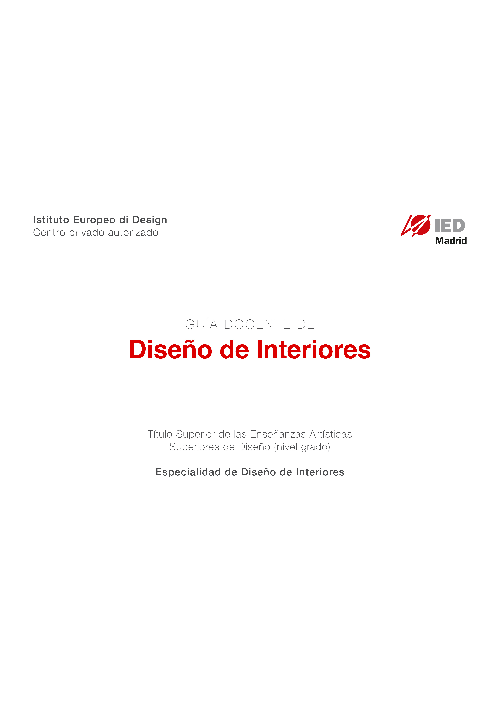

# Modelos y Maquetas I.  Técnicas Manuales -MALO

<table>
  <thead>
    <tr>
      <th style="text-align:left">
        
Curso 2019-20

        
<b> Istituto Europeo di Design</b>
           Centro privado autorizado

      </th>
      <th style="text-align:left">
        
      </th>
    </tr>
  </thead>
  <tbody></tbody>
</table>

GUÍA DOCENTE DE

## Diseño de Interiores

Modelos y Maquetas I.  
Técnicas Manuales

Título Superior de las  
Enseñanzas Artísticas Superiores de Diseño  
\(nivel grado\)

  
Especialidad de Diseño de Interiores

Fecha de actualización: 30 de septiembre de 2019

### Título Superior de las Enseñanzas Artísticas Superiores de Diseño \(nivel grado\)

### Asignatura: Modelos y Maquetas I. Técnicas Manuales

### 

## 1. IDENTIFICADORES DE LA ASIGNATURA

| **Tipo** |  |
| :--- | :--- |
| **Carácter** |  |
| **Especialidad/itinerario/estilo/instrumento** |  |
| **Materia** |  |
| **Periodo de impartición** |  |
| **Número de créditos** |  |
| **Departamento** |  |
| **Prelación/ requisitos previos** |  |
| **Idioma/s en los que se imparte** |  |

## 2. PROFESOR RESPONSABLE DE LA ASIGNATURA

| **Apellidos y nombre** | **Correo electrónico** |
| :--- | :--- |
|  |  |

## 3. RELACIÓN DE PROFESORES Y GRUPOS A LOS QUE IMPARTEN DOCENCIA

| **Apellidos y nombre** | **Correo electrónico** | **Grupos** |
| :--- | :--- | :--- |
|  |  |  |

## 

## 4. COMPETENCIAS

| **Competencias transversales** |
| :--- |
|  |
|  |
|  |
|  |
|  |
|  |

| **Competencias generales** |
| :--- |
|  |
|  |
|  |
|  |

| **Competencias específicas** |
| :--- |
|  |
|  |
|  |

## 

## 5. RESULTADOS DE APRENDIZAJE

**Identificar los procesos y técnicas manuales de modelización, prototipado y maquetismo.**

**Poder experimentar con los procesos y técnicas manuales de modelización, prototipado y maquetismo.**

**Ser capaz de aplicar las técnicas y procesos específicos para la construcción de objetos tridimensionales \(maquetas volumétricas, mock up y prototipo\) como parte fundamental del desarrollo del diseño de espacios y elementos de mobiliario y decoración.**

**Identificar y saber manejar las herramientas propias del taller de modelística.**

**Identificar y aplicar las condiciones que garantizan la seguridad durante el uso del taller de modelística.**

**Ser capaz de innovar en el desarrollo de modelos, prototipos y maquetas con técnicas manuales.**

## 

## 6. CONTENIDOS

| **Bloque temático \(en su caso\)** | **Tema/repertorio** |
| :--- | :--- |
| **I. Desarrollo de modelos y maquetas con técnicas manuales** | **Tema 1. Maqueta espacial** |
| **Tema 2. Prototipado rápido** |  |
| **Tema 3. Procesos** |  |
|  |  |

## 

## 7. PLANIFICACIÓN TEMPORAL DEL TRABAJO DEL ESTUDIANTE

| **Tipo de actividad** | **Total horas** |
| :--- | :--- |
|  |  |
|  |  |
|  |  |
|  |  |
|  |  |
|  |  |
|  |  |
| **Total de horas de trabajo del estudiante** | **120 horas** |

## 8. METODOLOGÍA

|  |  |
| :--- | :--- |
|  |  |
|  |  |

## 

## 9. CRITERIOS E INSTRUMENTOS DE EVALUACIÓN Y CALIFICACIÓN

##  9.1. INSTRUMENTOS DE EVALUACIÓN

|  |  |
| :--- | :--- |
|  |  |
|  |  |

**9.2. CRITERIOS DE EVALUACIÓN**  
Se evaluará:

**Identificar los procesos y técnicas manuales de modelización, prototipado y maquetismo.**

**Poder experimentar con los procesos y técnicas manuales de modelización, prototipado y maquetismo.**

**Ser capaz de aplicar las técnicas y procesos específicos para la construcción de objetos tridimensionales \(maquetas volumétricas, mock up y prototipo\) como parte fundamental del desarrollo del diseño de espacios y elementos de mobiliario y decoración.**

**Identificar y saber manejar las herramientas propias del taller de modelística.**

**Identificar y aplicar las condiciones que garantizan la seguridad durante el uso del taller de modelística.**

**Ser capaz de innovar en el desarrollo de modelos, prototipos y maquetas con técnicas manuales.**

La evaluación debe diseñarse y planificarse de manera que quede integrada dentro de las actividades formativas de enseñanza/aprendizaje.

Se propone que la evaluación del aprendizaje de los alumnos sea continua, personalizada e integradora:

**Continua en cuanto que está inmersa en el proceso de enseñanza-aprendizaje y consecuentemente no limitada por fechas o situaciones concretas.**

**Personalizada, ya que ha de tener en cuenta las capacidades, destrezas y actitudes del alumno. Se prestará especial atención en cuanto a la participación del alumno en los grupos de trabajo.**

**Integradora en cuanto exige tener en cuenta las capacidades generales establecidas para la etapa, a través de los objetivos de las distintas unidades temáticas y áreas.**

Se evaluarán los aprendizajes de los alumnos en relación con el logro de los objetivos educativos determinados en el currículo y asociados a los objetivos generales y específicos, tomando como referencia inmediata los criterios de evaluación establecidos para el área.

Para evaluar el proceso de aprendizaje de los alumnos es necesario:

**Evaluar la competencia curricular de los mismos \(capacidades y aptitudes\).**

**Evaluar los factores que dificultan o facilitan un buen aprendizaje.**

**Propiciar la autoevaluación y coevaluación de los propios alumnos como fuente de análisis y crítica de resultados, con el fin de permitir modificaciones de actitudes para su perfeccionamiento.**

**Valorar el contexto de aprendizaje en el que se desenvuelve el alumno.**

|  |  |
| :--- | :--- |
|  |  |
|  |  |

## 

## 9.3. CRITERIOS DE CALIFICACIÓN

1. El sistema de evaluación a emplear en la asignatura se adapta al modelo de la evaluación continua.
2. En el sistema de evaluación continua la asistencia a clase es obligatoria y el estudiante deberá cumplir con un porcentaje de actividad con presencia del profesor, cuya estimación será, en principio, del 80% \(mínimo\).
3. En aquellos casos en los que el estudiante no cumpla con los requisitos exigidos para la evaluación continua presentará una entrega específica para la evaluación con pérdida de evaluación continua que podrá constar de aquellas partes que se estimen oportunas, quedando reflejados sus correspondientes pesos relativos en el apartado correspondiente de esta guía.
4. En cualquier caso, el estudiante contará con una convocatoria extraordinaria cuya estructura, instrumento de evaluación y calificación queda explicitado en la esta guía.
5. Para optar a evaluación continua, se deben entregar todos y cada uno de los trabajos prácticos propuestos en la fecha establecida.

## 9.3.1. Ponderación de los instrumentos de evaluación para la evaluación continua

| **Instrumentos** | **Ponderación** |
| :--- | :--- |
|  |  |
|  |  |
| **Total** | **100%** |

## 

## 9.3.2. Ponderación de instrumentos de evaluación para la evaluación con pérdida de evaluación continua

| **Instrumentos** | **Ponderación** |
| :--- | :--- |
|  |  |
| **Total** | **100%** |

## 

## 9.3.3. Ponderación de instrumentos de evaluación para la evaluación extraordinaria

| **Instrumentos** |  |
| :--- | :--- |
|  |  |
| **Total** | **100%** |

## 

## 9.3.4. Ponderación para la evaluación de estudiantes con discapacidad

#### Las adaptaciones de los instrumentos de evaluación deberán tener en cuenta los diferentes tipos de discapacidad 

| **Instrumentos** | **Ponderación** |
| :--- | :--- |
|  |  |
| **Total** | **100%** |

## 

## 

## 10. PLANIFICACIÓN TEMPORAL DE LOS CONTENIDOS, METODOLOGÍA DOCENTE Y EVALUACIONES

<table>
  <thead>
    <tr>
      <th style="text-align:left"><b>Sesi&#xF3;n</b>
      </th>
      <th style="text-align:left"><b>CONTENIDOS, METODOLOG&#xCD;A DOCENTE ASOCIADA  E INSTRUMENTOS DE EVALUACI&#xD3;N</b>
      </th>
      <th style="text-align:left">
        
<b>Total</b>
        

        
<b>horas</b>
        

        
<b> presenciales</b>
        

      </th>
      <th style="text-align:left">
        
<b>Total</b>
        

        
 <b>horas no presenciales</b>
        

      </th>
    </tr>
  </thead>
  <tbody>
    <tr>
      <td style="text-align:left"><b>Sesi&#xF3;n 1</b>
      </td>
      <td style="text-align:left"><b>TEMA 1: Maqueta espacial</b>
      </td>
      <td style="text-align:left"></td>
      <td style="text-align:left"></td>
    </tr>
    <tr>
      <td style="text-align:left"><b>Actividades te&#xF3;ricas</b>
      </td>
      <td style="text-align:left"><b>Clase magistral en la que se desarrollaran los contenidos concretos de la secci&#xF3;n (La maqueta espacial). El docente utilizar&#xE1; documentos e im&#xE1;genes que analizar&#xE1; utilizando las TICs que sean necesarias.</b>
      </td>
      <td style="text-align:left"><b>2,5 horas</b>
      </td>
      <td style="text-align:left">
        
<b>2</b>
        

        
<b>horas</b>
        

      </td>
    </tr>
    <tr>
      <td style="text-align:left"><b>Otras actividades formativas</b>
      </td>
      <td style="text-align:left"><b>Taller de interiores</b>
      </td>
      <td style="text-align:left">
        
<b>2</b>
        

        
<b>horas</b>
        

      </td>
      <td style="text-align:left"></td>
    </tr>
  </tbody>
</table>

<table>
  <thead>
    <tr>
      <th style="text-align:left"><b>Sesi&#xF3;n 2</b>
      </th>
      <th style="text-align:left"><b>TEMA 1: Maqueta espacial</b>
      </th>
      <th style="text-align:left"></th>
      <th style="text-align:left"></th>
    </tr>
  </thead>
  <tbody>
    <tr>
      <td style="text-align:left"><b>Clases te&#xF3;rico-pr&#xE1;cticas</b>
      </td>
      <td style="text-align:left"><b>Clase magistral en la que se desarrollaran los contenidos concretos de la secci&#xF3;n (Maqueta espacial). El docente utilizar&#xE1; documentos e im&#xE1;genes que analizar&#xE1; utilizando las TICs que sean necesarias.</b>
      </td>
      <td style="text-align:left">
        
<b>1</b>
        

        
<b>hora</b>
        

      </td>
      <td style="text-align:left">
        
<b>1</b>
        

        
<b>hora</b>
        

      </td>
    </tr>
    <tr>
      <td style="text-align:left"><b>Clases pr&#xE1;cticas</b>
      </td>
      <td style="text-align:left"><b>Trabajo pr&#xE1;ctico/modelos y maquetas</b>
      </td>
      <td style="text-align:left">
        
<b>1</b>
        

        
<b>hora</b>
        

      </td>
      <td style="text-align:left">
        
<b>2</b>
        

        
<b>horas</b>
        

      </td>
    </tr>
    <tr>
      <td style="text-align:left"><b>Otras actividades formativas</b>
      </td>
      <td style="text-align:left"><b>Taller de interiores</b>
      </td>
      <td style="text-align:left">
        
<b>2</b>
        

        
<b>horas</b>
        

      </td>
      <td style="text-align:left"></td>
    </tr>
    <tr>
      <td style="text-align:left"><b>Evaluaci&#xF3;n</b>
      </td>
      <td style="text-align:left"><b>Revisi&#xF3;n trabajo pr&#xE1;ctico/proyecto</b>
      </td>
      <td style="text-align:left"><b>0,5 horas</b>
      </td>
      <td style="text-align:left"></td>
    </tr>
  </tbody>
</table>

<table>
  <thead>
    <tr>
      <th style="text-align:left"><b>Sesi&#xF3;n 3</b>
      </th>
      <th style="text-align:left"><b>TEMA 1: Maqueta espacial</b>
      </th>
      <th style="text-align:left"></th>
      <th style="text-align:left"></th>
    </tr>
  </thead>
  <tbody>
    <tr>
      <td style="text-align:left"><b>Clases te&#xF3;rico-pr&#xE1;cticas</b>
      </td>
      <td style="text-align:left"><b>Clase magistral en la que se desarrollaran los contenidos concretos de la secci&#xF3;n (Maqueta espacial). El docente utilizar&#xE1; documentos e im&#xE1;genes que analizar&#xE1; utilizando las TICs que sean necesarias.</b>
      </td>
      <td style="text-align:left">
        
<b>1</b>
        

        
<b>hora</b>
        

      </td>
      <td style="text-align:left">
        
<b>1</b>
        

        
<b>hora</b>
        

      </td>
    </tr>
    <tr>
      <td style="text-align:left"><b>Clases pr&#xE1;cticas</b>
      </td>
      <td style="text-align:left"><b>Trabajo pr&#xE1;ctico/modelos y maquetas</b>
      </td>
      <td style="text-align:left">
        
<b>1</b>
        

        
<b>hora</b>
        

      </td>
      <td style="text-align:left">
        
<b>2</b>
        

        
<b>horas</b>
        

      </td>
    </tr>
    <tr>
      <td style="text-align:left"><b>Otras actividades formativas</b>
      </td>
      <td style="text-align:left"><b>Taller de interiores</b>
      </td>
      <td style="text-align:left">
        
<b>2</b>
        

        
<b>horas</b>
        

      </td>
      <td style="text-align:left"></td>
    </tr>
    <tr>
      <td style="text-align:left"><b>Evaluaci&#xF3;n</b>
      </td>
      <td style="text-align:left"><b>Revisi&#xF3;n trabajo pr&#xE1;ctico/proyecto</b>
      </td>
      <td style="text-align:left"><b>0,5 horas</b>
      </td>
      <td style="text-align:left"></td>
    </tr>
  </tbody>
</table>

<table>
  <thead>
    <tr>
      <th style="text-align:left"><b>Sesi&#xF3;n 4</b>
      </th>
      <th style="text-align:left"><b>TEMA 2: Prototipado r&#xE1;pido</b>
      </th>
      <th style="text-align:left"></th>
      <th style="text-align:left"></th>
    </tr>
  </thead>
  <tbody>
    <tr>
      <td style="text-align:left"><b>Clases te&#xF3;rico-pr&#xE1;cticas</b>
      </td>
      <td style="text-align:left"><b>Clase magistral en la que se desarrollaran los contenidos concretos de la secci&#xF3;n (Prototipado r&#xE1;pido). El docente utilizar&#xE1; documentos e im&#xE1;genes que analizar&#xE1; utilizando las TICs que sean necesarias.</b>
      </td>
      <td style="text-align:left">
        
<b>1</b>
        

        
<b>hora</b>
        

      </td>
      <td style="text-align:left">
        
<b>1</b>
        

        
<b>hora</b>
        

      </td>
    </tr>
    <tr>
      <td style="text-align:left"><b>Clases pr&#xE1;cticas</b>
      </td>
      <td style="text-align:left"><b>Trabajo pr&#xE1;ctico/modelos y maquetas</b>
      </td>
      <td style="text-align:left">
        
<b>1</b>
        

        
<b>hora</b>
        

      </td>
      <td style="text-align:left">
        
<b>2</b>
        

        
<b>horas</b>
        

      </td>
    </tr>
    <tr>
      <td style="text-align:left"><b>Otras actividades formativas</b>
      </td>
      <td style="text-align:left"><b>Taller de interiores</b>
      </td>
      <td style="text-align:left">
        
<b>2</b>
        

        
<b>horas</b>
        

      </td>
      <td style="text-align:left"></td>
    </tr>
    <tr>
      <td style="text-align:left"><b>Evaluaci&#xF3;n</b>
      </td>
      <td style="text-align:left"><b>Revisi&#xF3;n trabajo pr&#xE1;ctico/proyecto</b>
      </td>
      <td style="text-align:left"><b>0,5 horas</b>
      </td>
      <td style="text-align:left"></td>
    </tr>
  </tbody>
</table>

<table>
  <thead>
    <tr>
      <th style="text-align:left"><b>Sesi&#xF3;n 5</b>
      </th>
      <th style="text-align:left"><b>TEMA 2: Prototipado r&#xE1;pido</b>
      </th>
      <th style="text-align:left"></th>
      <th style="text-align:left"></th>
    </tr>
  </thead>
  <tbody>
    <tr>
      <td style="text-align:left"><b>Clases te&#xF3;rico-pr&#xE1;cticas</b>
      </td>
      <td style="text-align:left"><b>Clase magistral en la que se desarrollaran los contenidos concretos de la secci&#xF3;n (Prototipado r&#xE1;pido). El docente utilizar&#xE1; documentos e im&#xE1;genes que analizar&#xE1; utilizando las TICs que sean necesarias.</b>
      </td>
      <td style="text-align:left">
        
<b>1</b>
        

        
<b>hora</b>
        

      </td>
      <td style="text-align:left">
        
<b>1</b>
        

        
<b>hora</b>
        

      </td>
    </tr>
    <tr>
      <td style="text-align:left"><b>Clases pr&#xE1;cticas</b>
      </td>
      <td style="text-align:left"><b>Trabajo pr&#xE1;ctico/modelos y maquetas</b>
      </td>
      <td style="text-align:left">
        
<b>1</b>
        

        
<b>hora</b>
        

      </td>
      <td style="text-align:left">
        
<b>2</b>
        

        
<b>horas</b>
        

      </td>
    </tr>
    <tr>
      <td style="text-align:left"><b>Otras actividades formativas</b>
      </td>
      <td style="text-align:left"><b>Taller de interiores</b>
      </td>
      <td style="text-align:left">
        
<b>2</b>
        

        
<b>horas</b>
        

      </td>
      <td style="text-align:left"></td>
    </tr>
    <tr>
      <td style="text-align:left"><b>Evaluaci&#xF3;n</b>
      </td>
      <td style="text-align:left"><b>Revisi&#xF3;n trabajo pr&#xE1;ctico/proyecto</b>
      </td>
      <td style="text-align:left"><b>0,5 horas</b>
      </td>
      <td style="text-align:left"></td>
    </tr>
  </tbody>
</table>

<table>
  <thead>
    <tr>
      <th style="text-align:left"><b>Sesi&#xF3;n 6</b>
      </th>
      <th style="text-align:left"><b>TEMA 2: Prototipado r&#xE1;pido</b>
      </th>
      <th style="text-align:left"></th>
      <th style="text-align:left"></th>
    </tr>
  </thead>
  <tbody>
    <tr>
      <td style="text-align:left"><b>Clases te&#xF3;rico-pr&#xE1;cticas</b>
      </td>
      <td style="text-align:left"><b>Clase magistral en la que se desarrollaran los contenidos concretos de la secci&#xF3;n (Prototipado r&#xE1;pido). El docente utilizar&#xE1; documentos e im&#xE1;genes que analizar&#xE1; utilizando las TICs que sean necesarias.</b>
      </td>
      <td style="text-align:left">
        
<b>1</b>
        

        
<b>hora</b>
        

      </td>
      <td style="text-align:left">
        
<b>1</b>
        

        
<b>hora</b>
        

      </td>
    </tr>
    <tr>
      <td style="text-align:left"><b>Clases pr&#xE1;cticas</b>
      </td>
      <td style="text-align:left"><b>Trabajo pr&#xE1;ctico/modelos y maquetas</b>
      </td>
      <td style="text-align:left">
        
<b>1</b>
        

        
<b>hora</b>
        

      </td>
      <td style="text-align:left">
        
<b>2</b>
        

        
<b>horas</b>
        

      </td>
    </tr>
    <tr>
      <td style="text-align:left"><b>Otras actividades formativas</b>
      </td>
      <td style="text-align:left"><b>Taller de interiores</b>
      </td>
      <td style="text-align:left">
        
<b>2</b>
        

        
<b>horas</b>
        

      </td>
      <td style="text-align:left"></td>
    </tr>
    <tr>
      <td style="text-align:left"><b>Evaluaci&#xF3;n</b>
      </td>
      <td style="text-align:left"><b>Revisi&#xF3;n trabajo pr&#xE1;ctico/proyecto</b>
      </td>
      <td style="text-align:left"><b>0,5 horas</b>
      </td>
      <td style="text-align:left"></td>
    </tr>
  </tbody>
</table>

<table>
  <thead>
    <tr>
      <th style="text-align:left"><b>Sesi&#xF3;n 7</b>
      </th>
      <th style="text-align:left"><b>TEMA 3: Procesos</b>
      </th>
      <th style="text-align:left"></th>
      <th style="text-align:left"></th>
    </tr>
  </thead>
  <tbody>
    <tr>
      <td style="text-align:left"><b>Clases te&#xF3;rico-pr&#xE1;cticas</b>
      </td>
      <td style="text-align:left"><b>Clase magistral en la que se desarrollaran los contenidos concretos de la secci&#xF3;n (Procesos). El docente utilizar&#xE1; documentos e im&#xE1;genes que analizar&#xE1; utilizando las TICs que sean necesarias.</b>
      </td>
      <td style="text-align:left">
        
<b>1</b>
        

        
<b>hora</b>
        

      </td>
      <td style="text-align:left">
        
<b>1</b>
        

        
<b>hora</b>
        

      </td>
    </tr>
    <tr>
      <td style="text-align:left"><b>Clases pr&#xE1;cticas</b>
      </td>
      <td style="text-align:left"><b>Trabajo pr&#xE1;ctico/modelos y maquetas</b>
      </td>
      <td style="text-align:left">
        
<b>1</b>
        

        
<b>hora</b>
        

      </td>
      <td style="text-align:left">
        
<b>2</b>
        

        
<b>horas</b>
        

      </td>
    </tr>
    <tr>
      <td style="text-align:left"><b>Otras actividades formativas</b>
      </td>
      <td style="text-align:left"><b>Taller de interiores</b>
      </td>
      <td style="text-align:left">
        
<b>2</b>
        

        
<b>horas</b>
        

      </td>
      <td style="text-align:left"></td>
    </tr>
    <tr>
      <td style="text-align:left"><b>Evaluaci&#xF3;n</b>
      </td>
      <td style="text-align:left"><b>Revisi&#xF3;n trabajo pr&#xE1;ctico/proyecto</b>
      </td>
      <td style="text-align:left"><b>0,5 horas</b>
      </td>
      <td style="text-align:left"></td>
    </tr>
  </tbody>
</table>

<table>
  <thead>
    <tr>
      <th style="text-align:left"><b>Sesi&#xF3;n 8</b>
      </th>
      <th style="text-align:left"><b>TEMA 3: Procesos</b>
      </th>
      <th style="text-align:left"></th>
      <th style="text-align:left"></th>
    </tr>
  </thead>
  <tbody>
    <tr>
      <td style="text-align:left"><b>Clases te&#xF3;rico-pr&#xE1;cticas</b>
      </td>
      <td style="text-align:left"><b>Clase magistral en la que se desarrollaran los contenidos concretos de la secci&#xF3;n (Procesos). El docente utilizar&#xE1; documentos e im&#xE1;genes que analizar&#xE1; utilizando las TICs que sean necesarias.</b>
      </td>
      <td style="text-align:left">
        
<b>1</b>
        

        
<b>hora</b>
        

      </td>
      <td style="text-align:left">
        
<b>1</b>
        

        
<b>hora</b>
        

      </td>
    </tr>
    <tr>
      <td style="text-align:left"><b>Clases pr&#xE1;cticas</b>
      </td>
      <td style="text-align:left"><b>Trabajo pr&#xE1;ctico/modelos y maquetas</b>
      </td>
      <td style="text-align:left">
        
<b>1</b>
        

        
<b>hora</b>
        

      </td>
      <td style="text-align:left">
        
<b>2</b>
        

        
<b>horas</b>
        

      </td>
    </tr>
    <tr>
      <td style="text-align:left"><b>Otras actividades formativas</b>
      </td>
      <td style="text-align:left"><b>Taller de interiores</b>
      </td>
      <td style="text-align:left">
        
<b>2</b>
        

        
<b>horas</b>
        

      </td>
      <td style="text-align:left"></td>
    </tr>
    <tr>
      <td style="text-align:left"><b>Evaluaci&#xF3;n</b>
      </td>
      <td style="text-align:left"><b>Revisi&#xF3;n trabajo pr&#xE1;ctico/proyecto</b>
      </td>
      <td style="text-align:left"><b>0,5 horas</b>
      </td>
      <td style="text-align:left"></td>
    </tr>
  </tbody>
</table>

<table>
  <thead>
    <tr>
      <th style="text-align:left"><b>Sesi&#xF3;n 9</b>
      </th>
      <th style="text-align:left"><b>TEMA 3: Procesos</b>
      </th>
      <th style="text-align:left"></th>
      <th style="text-align:left"></th>
    </tr>
  </thead>
  <tbody>
    <tr>
      <td style="text-align:left"><b>Clases te&#xF3;rico-pr&#xE1;cticas</b>
      </td>
      <td style="text-align:left"><b>Clase magistral en la que se desarrollaran los contenidos concretos de la secci&#xF3;n (Procesos). El docente utilizar&#xE1; documentos e im&#xE1;genes que analizar&#xE1; utilizando las TICs que sean necesarias.</b>
      </td>
      <td style="text-align:left">
        
<b>1</b>
        

        
<b>hora</b>
        

      </td>
      <td style="text-align:left">
        
<b>1</b>
        

        
<b>hora</b>
        

      </td>
    </tr>
    <tr>
      <td style="text-align:left"><b>Clases pr&#xE1;cticas</b>
      </td>
      <td style="text-align:left"><b>Trabajo pr&#xE1;ctico/modelos y maquetas</b>
      </td>
      <td style="text-align:left">
        
<b>1</b>
        

        
<b>hora</b>
        

      </td>
      <td style="text-align:left">
        
<b>2</b>
        

        
<b>horas</b>
        

      </td>
    </tr>
    <tr>
      <td style="text-align:left"><b>Otras actividades formativas</b>
      </td>
      <td style="text-align:left"><b>Taller de interiores</b>
      </td>
      <td style="text-align:left">
        
<b>2</b>
        

        
<b>horas</b>
        

      </td>
      <td style="text-align:left"></td>
    </tr>
    <tr>
      <td style="text-align:left"><b>Evaluaci&#xF3;n</b>
      </td>
      <td style="text-align:left"><b>Revisi&#xF3;n trabajo pr&#xE1;ctico/proyecto</b>
      </td>
      <td style="text-align:left"><b>0,5 horas</b>
      </td>
      <td style="text-align:left"></td>
    </tr>
  </tbody>
</table>

<table>
  <thead>
    <tr>
      <th style="text-align:left"><b>Sesi&#xF3;n 10</b>
      </th>
      <th style="text-align:left"><b>TEMA 4: T&#xE9;cnicas de plegado</b>
      </th>
      <th style="text-align:left"></th>
      <th style="text-align:left"></th>
    </tr>
  </thead>
  <tbody>
    <tr>
      <td style="text-align:left"><b>Clases te&#xF3;rico-pr&#xE1;cticas</b>
      </td>
      <td style="text-align:left"><b>Clase magistral en la que se desarrollaran los contenidos concretos de la secci&#xF3;n (T&#xE9;cnicas plegado). El docente utilizar&#xE1; documentos e im&#xE1;genes que analizar&#xE1; utilizando las TICs que sean necesarias.</b>
      </td>
      <td style="text-align:left">
        
<b>1</b>
        

        
<b>hora</b>
        

      </td>
      <td style="text-align:left">
        
<b>1</b>
        

        
<b>hora</b>
        

      </td>
    </tr>
    <tr>
      <td style="text-align:left"><b>Clases pr&#xE1;cticas</b>
      </td>
      <td style="text-align:left"><b>Trabajo pr&#xE1;ctico/modelos y maquetas</b>
      </td>
      <td style="text-align:left">
        
<b>1</b>
        

        
<b>hora</b>
        

      </td>
      <td style="text-align:left">
        
<b>2</b>
        

        
<b>horas</b>
        

      </td>
    </tr>
    <tr>
      <td style="text-align:left"><b>Otras actividades formativas</b>
      </td>
      <td style="text-align:left"><b>Taller de interiores</b>
      </td>
      <td style="text-align:left">
        
<b>2</b>
        

        
<b>horas</b>
        

      </td>
      <td style="text-align:left"></td>
    </tr>
    <tr>
      <td style="text-align:left"><b>Evaluaci&#xF3;n</b>
      </td>
      <td style="text-align:left"><b>Revisi&#xF3;n trabajo pr&#xE1;ctico/proyecto</b>
      </td>
      <td style="text-align:left"><b>0,5 horas</b>
      </td>
      <td style="text-align:left"></td>
    </tr>
  </tbody>
</table>

<table>
  <thead>
    <tr>
      <th style="text-align:left"><b>Sesi&#xF3;n 11</b>
      </th>
      <th style="text-align:left"><b>TEMA 4: T&#xE9;cnicas de plegado</b>
      </th>
      <th style="text-align:left"></th>
      <th style="text-align:left"></th>
    </tr>
  </thead>
  <tbody>
    <tr>
      <td style="text-align:left"><b>Clases te&#xF3;rico-pr&#xE1;cticas</b>
      </td>
      <td style="text-align:left"><b>Clase magistral en la que se desarrollaran los contenidos concretos de la secci&#xF3;n (T&#xE9;cnicas Plegado). El docente utilizar&#xE1; documentos e im&#xE1;genes que analizar&#xE1; utilizando las TICs que sean necesarias.</b>
      </td>
      <td style="text-align:left">
        
<b>1</b>
        

        
<b>hora</b>
        

      </td>
      <td style="text-align:left">
        
<b>1</b>
        

        
<b>hora</b>
        

      </td>
    </tr>
    <tr>
      <td style="text-align:left"><b>Clases pr&#xE1;cticas</b>
      </td>
      <td style="text-align:left"><b>Trabajo pr&#xE1;ctico/modelos y maquetas</b>
      </td>
      <td style="text-align:left">
        
<b>1</b>
        

        
<b>hora</b>
        

      </td>
      <td style="text-align:left">
        
<b>2</b>
        

        
<b>horas</b>
        

      </td>
    </tr>
    <tr>
      <td style="text-align:left"><b>Otras actividades formativas</b>
      </td>
      <td style="text-align:left"><b>Taller de interiores</b>
      </td>
      <td style="text-align:left">
        
<b>2</b>
        

        
<b>horas</b>
        

      </td>
      <td style="text-align:left"></td>
    </tr>
    <tr>
      <td style="text-align:left"><b>Evaluaci&#xF3;n</b>
      </td>
      <td style="text-align:left"><b>Revisi&#xF3;n trabajo pr&#xE1;ctico/proyecto</b>
      </td>
      <td style="text-align:left"><b>0,5 horas</b>
      </td>
      <td style="text-align:left"></td>
    </tr>
  </tbody>
</table>

<table>
  <thead>
    <tr>
      <th style="text-align:left"><b>Sesi&#xF3;n 12</b>
      </th>
      <th style="text-align:left"><b>TEMA 4: T&#xE9;cnicas de plegado</b>
      </th>
      <th style="text-align:left"></th>
      <th style="text-align:left"></th>
    </tr>
  </thead>
  <tbody>
    <tr>
      <td style="text-align:left"><b>Clases te&#xF3;rico-pr&#xE1;cticas</b>
      </td>
      <td style="text-align:left"><b>Clase magistral en la que se desarrollaran los contenidos concretos de la secci&#xF3;n (T. plegado). El docente utilizar&#xE1; documentos e im&#xE1;genes que analizar&#xE1; utilizando las TICs que sean necesarias.</b>
      </td>
      <td style="text-align:left">
        
<b>1</b>
        

        
<b>hora</b>
        

      </td>
      <td style="text-align:left">
        
<b>1</b>
        

        
<b>hora</b>
        

      </td>
    </tr>
    <tr>
      <td style="text-align:left"><b>Clases pr&#xE1;cticas</b>
      </td>
      <td style="text-align:left"><b>Trabajo pr&#xE1;ctico/modelos y maquetas</b>
      </td>
      <td style="text-align:left">
        
<b>1</b>
        

        
<b>hora</b>
        

      </td>
      <td style="text-align:left">
        
<b>2</b>
        

        
<b>horas</b>
        

      </td>
    </tr>
    <tr>
      <td style="text-align:left"><b>Otras actividades formativas</b>
      </td>
      <td style="text-align:left"><b>Taller de interiores</b>
      </td>
      <td style="text-align:left">
        
<b>2</b>
        

        
<b>horas</b>
        

      </td>
      <td style="text-align:left"></td>
    </tr>
    <tr>
      <td style="text-align:left"><b>Evaluaci&#xF3;n</b>
      </td>
      <td style="text-align:left"><b>Revisi&#xF3;n trabajo pr&#xE1;ctico/proyecto</b>
      </td>
      <td style="text-align:left"><b>0,5 horas</b>
      </td>
      <td style="text-align:left"></td>
    </tr>
  </tbody>
</table>

<table>
  <thead>
    <tr>
      <th style="text-align:left"><b>Sesi&#xF3;n 13</b>
      </th>
      <th style="text-align:left"><b>TEMA 4: T&#xE9;cnicas de plegado</b>
      </th>
      <th style="text-align:left"></th>
      <th style="text-align:left"></th>
    </tr>
  </thead>
  <tbody>
    <tr>
      <td style="text-align:left"><b>Clases te&#xF3;rico-pr&#xE1;cticas</b>
      </td>
      <td style="text-align:left"><b>Clase magistral en la que se desarrollaran los contenidos concretos de la secci&#xF3;n (T. plegado). El docente utilizar&#xE1; documentos e im&#xE1;genes que analizar&#xE1; utilizando las TICs que sean necesarias.</b>
      </td>
      <td style="text-align:left">
        
<b>1</b>
        

        
<b>hora</b>
        

      </td>
      <td style="text-align:left">
        
<b>1</b>
        

        
<b>hora</b>
        

      </td>
    </tr>
    <tr>
      <td style="text-align:left"><b>Clases pr&#xE1;cticas</b>
      </td>
      <td style="text-align:left"><b>Trabajo pr&#xE1;ctico/modelos y maquetas</b>
      </td>
      <td style="text-align:left">
        
<b>1</b>
        

        
<b>hora</b>
        

      </td>
      <td style="text-align:left">
        
<b>2</b>
        

        
<b>horas</b>
        

      </td>
    </tr>
    <tr>
      <td style="text-align:left"><b>Otras actividades formativas</b>
      </td>
      <td style="text-align:left"><b>Taller de interiores</b>
      </td>
      <td style="text-align:left">
        
<b>2</b>
        

        
<b>horas</b>
        

      </td>
      <td style="text-align:left"></td>
    </tr>
    <tr>
      <td style="text-align:left"><b>Evaluaci&#xF3;n</b>
      </td>
      <td style="text-align:left"><b>Revisi&#xF3;n trabajo pr&#xE1;ctico/proyecto</b>
      </td>
      <td style="text-align:left"><b>0,5 horas</b>
      </td>
      <td style="text-align:left"></td>
    </tr>
  </tbody>
</table>

<table>
  <thead>
    <tr>
      <th style="text-align:left"><b>Sesi&#xF3;n 14</b>
      </th>
      <th style="text-align:left"><b>Revisi&#xF3;n proyectos</b>
      </th>
      <th style="text-align:left"></th>
      <th style="text-align:left"></th>
    </tr>
  </thead>
  <tbody>
    <tr>
      <td style="text-align:left"><b>Clases te&#xF3;rico-pr&#xE1;cticas</b>
      </td>
      <td style="text-align:left"><b>Clase magistral en la que se desarrollaran los contenidos concretos de la secci&#xF3;n (Pensar, construir, comunicar). El docente utilizar&#xE1; documentos e im&#xE1;genes que analizar&#xE1; utilizando las TICs que sean necesarias.</b>
      </td>
      <td style="text-align:left">
        
<b>1</b>
        

        
<b>hora</b>
        

      </td>
      <td style="text-align:left">
        
<b>1</b>
        

        
<b>hora</b>
        

      </td>
    </tr>
    <tr>
      <td style="text-align:left"><b>Clases pr&#xE1;cticas</b>
      </td>
      <td style="text-align:left"><b>Trabajo pr&#xE1;ctico/modelos y maquetas</b>
      </td>
      <td style="text-align:left">
        
<b>1</b>
        

        
<b>hora</b>
        

      </td>
      <td style="text-align:left">
        
<b>3</b>
        

        
<b>horas</b>
        

      </td>
    </tr>
    <tr>
      <td style="text-align:left"><b>Otras actividades formativas</b>
      </td>
      <td style="text-align:left"><b>Taller de interiores</b>
      </td>
      <td style="text-align:left">
        
<b>2</b>
        

        
<b>horas</b>
        

      </td>
      <td style="text-align:left"></td>
    </tr>
    <tr>
      <td style="text-align:left"><b>Evaluaci&#xF3;n</b>
      </td>
      <td style="text-align:left"><b>Revisi&#xF3;n trabajo pr&#xE1;ctico/proyecto</b>
      </td>
      <td style="text-align:left"><b>0,5 horas</b>
      </td>
      <td style="text-align:left"></td>
    </tr>
  </tbody>
</table>

<table>
  <thead>
    <tr>
      <th style="text-align:left"><b>Sesi&#xF3;n 15</b>
      </th>
      <th style="text-align:left"><b>Presentaci&#xF3;n proyectos finales</b>
      </th>
      <th style="text-align:left"></th>
      <th style="text-align:left"></th>
    </tr>
  </thead>
  <tbody>
    <tr>
      <td style="text-align:left"><b>Otras actividades formativas</b>
      </td>
      <td style="text-align:left"><b>Taller de interiores</b>
      </td>
      <td style="text-align:left">
        
<b>4</b>
        

        
<b>horas</b>
        

      </td>
      <td style="text-align:left"></td>
    </tr>
    <tr>
      <td style="text-align:left"><b>Evaluaci&#xF3;n</b>
      </td>
      <td style="text-align:left"><b>Realizaci&#xF3;n, presentaci&#xF3;n y entrega de ejercicios pr&#xE1;cticos</b>
      </td>
      <td style="text-align:left"><b>2,5 horas</b>
      </td>
      <td style="text-align:left">
        
<b>6</b>
        

        
<b>horas</b>
        

      </td>
    </tr>
  </tbody>
</table>

| **Sesión 16** | **Evaluación. Entrega de notas** |  |  |
| :--- | :--- | :--- | :--- |
| **Evaluación** | **Entrega de notas al alumno, correcciones y evaluación final.** | **2,5 horas** |  |

## 11. RECURSOS Y MATERIALES DIDÁCTICOS

#### Recursos y materiales didácticos disponibles en el campus virtual para cada bloque temático.

#### 

#### Las actividades prácticas se desarrollarán en el espacio del taller de modelística del IED Madrid.

#### Se facilitará al alumno indumentaria básica de seguridad adecuada a la práctica propuesta.

##  11.1. Bibliografía general

|  |  |
| :--- | :--- |
|  |  |
|  |  |

|  |  |
| :--- | :--- |
|  |  |
|  |  |

|  |  |
| :--- | :--- |
|  |  |
|  |  |

## 

## 11.2. Bibliografía complementaria

|  |  |
| :--- | :--- |
|  |  |
|  |  |

|  |  |
| :--- | :--- |
|  |  |
|  |  |

## 

## 

## 11.3. Direcciones web de interés

|  |
| :--- |
|  |
|  |

## 

## 11.4. Otros materiales y recursos didácticos

|  |
| :--- |
|  |
|  |

